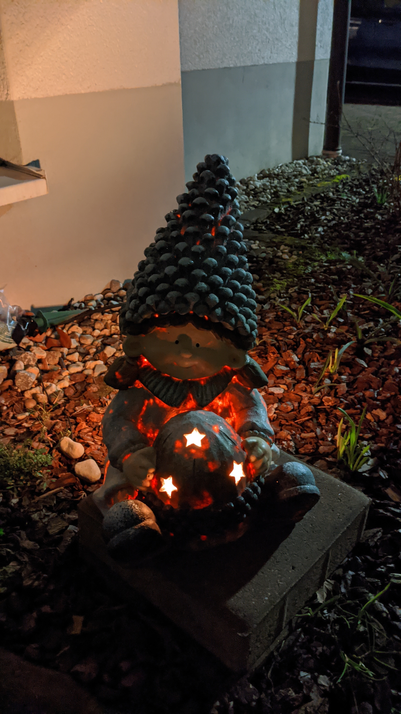

# ESP-32 firmware for candle-simualtion 

Uses an ESP-32 to control a neopixel ring to simulate a candle
Features
* candle simulation
* remote control via mqtt topic
* "special effects" triggerd every X minute or via mqtt

Build by setting the wifi SSID and passwort via

export PLATFORMIO_BUILD_FLAGS="'-DWSSID=\"yourSSID\"' '-DWPWD=\"mypwd\"'"

